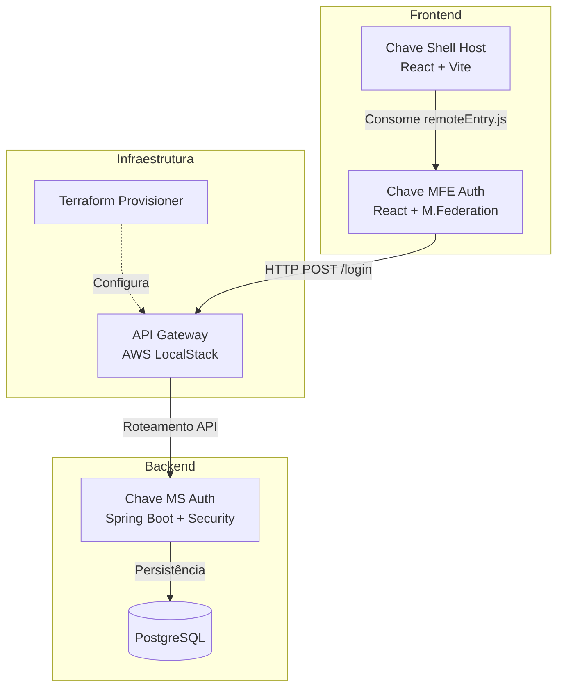

# Chave - Enterprise Micro-Frontend Architecture


Bem-vindo ao repositório do **Chave**, uma arquitetura corporativa completa baseada em Micro-frontends (MFE), com backend robusto em Java e provisionamento de infraestrutura automatizado.

Este projeto foi construído seguindo rigorosos padrões de **TDD (Test-Driven Development)**, garantindo confiabilidade, tipagem forte com TypeScript e segurança através da federação de módulos.

---

## 📑 Índice
- [Chave - Enterprise Micro-Frontend Architecture](#chave---enterprise-micro-frontend-architecture)
  - [📑 Índice](#-índice)
  - [🏛️ Arquitetura do Sistema](#️-arquitetura-do-sistema)
  - [🏗️ Estrutura do Monorepo](#️-estrutura-do-monorepo)
  - [🚀 Como Executar Localmente](#-como-executar-localmente)
    - [1. Infraestrutura e Backend (Docker)](#1-infraestrutura-e-backend-docker)
    - [2. Micro-frontends (MFE \& Shell)](#2-micro-frontends-mfe--shell)
  - [🧪 Qualidade e Testes Automatizados](#-qualidade-e-testes-automatizados)
  - [📚 Documentação Técnica](#-documentação-técnica)

---

## 🏛️ Arquitetura do Sistema

A comunicação da aplicação é descentralizada. O **Shell** atua como host principal (Container), consumindo a federação do **MFE Auth** (Remote) em tempo de execução via *Module Federation*. Toda chamada externa do MFE é roteada para o Backend protegido.



---

## 🏗️ Estrutura do Monorepo

O projeto é dividido em domínios arquiteturais claros:

- 🟢 **`Trabalho_Eng_Soft_II` (Backend):** Aplicação Spring Boot e JPA. Filtros de segurança via JWT e testes cobertos por JaCoCo (>70%).
- 🔵 **`front-end` (MFE Remoto):** Aplicação encapsulada expondo o domínio de Autenticação (`LoginPage`, `RegisterForm` e Lógica de Sessão).
- 🔵 **`chave-shell-main` (Shell Host):** Ponto de entrada do usuário (`localhost:3000`). Gerencia as rotas protegidas (`PrivateRoute`) e layout global (Material UI).
- 🟣 **`chave-infra-main` (Infraestrutura):** Orquestração completa (`docker-compose.yml`) integrando o AWS MiniStack, Postgres e rodando os scripts do Terraform automaticamente.

---

## 🚀 Como Executar Localmente

> **Pré-requisitos:** Docker Desktop, Node.js (v18+) e Java (JDK 21) instalados.

### 1. Infraestrutura e Backend (Docker)
Inicie todos os serviços core de uma só vez:

```bash
cd chave-infra-main/chave-infra-main
cp .env.example .env

# Sobe os contêineres e roda a infra via Terraform
make setup
```
*(O Swagger do Backend ficará disponível em http://localhost:3001/swagger-ui/index.html)*

### 2. Micro-frontends (MFE & Shell)
Abra terminais separados para rodar as interfaces.

**MFE Auth (Remoto):**
```bash
cd front-end
npm install
npm run dev # Disponível em localhost:4001
```

**Shell Host (Aplicação Principal):**
```bash
cd chave-shell-main/chave-shell-main
npm install
npm run dev # Disponível em localhost:3000
```
Acesse [http://localhost:3000](http://localhost:3000) para visualizar o projeto completo.

---

## 🧪 Qualidade e Testes Automatizados

O sistema foi rigorosamente coberto usando metodologias ágeis.

- **Backend (JUnit/Mockito):** Regras de JaCoCo ativas falham o build se a cobertura ficar abaixo de 70%.
  ```bash
  cd Trabalho_Eng_Soft_II
  .\mvnw verify
  ```
- **Frontends (Vitest + Testing Library):** Mock de APIs e rotas.
  ```bash
  # No front-end ou no shell
  npm run test:coverage
  ```
- **Smoke Tests E2E:** Um script em PowerShell foi criado para validar se todas as camadas (Gateway, Backend, Remote e Shell) estão de pé.
  ```bash
  cd scripts
  .\smoke_tests.ps1
  ```

---

## 📚 Documentação Técnica

Os detalhes arquiteturais, registros do TDD e guias de resolução de problemas estão centralizados na pasta `/docs`:

* 🏗️ **Arquitetura:** 
  * [Baseline e Requisitos](./docs/architecture/01-baseline-system.md)
  * [Critérios de Aceite](./docs/architecture/02-acceptance-criteria.md)
  * [Trade-offs e Decisões](./docs/architecture/03-trade-offs.md)
* ⚙️ **DevOps e CI/CD:**
  * [Runbook Local](./docs/devops/runbook-and-troubleshooting.md)
  * [Configuração do Pipeline (GitHub Actions)](../.github/workflows/pipeline.yml)
* 🎨 **Design System:**
  * [Manual de UI](./docs/ui-manual.md)
* 📜 **Jornada TDD (Histórico):**
  * [Logs do Backend](./docs/tdd-journey/backend-tdd-logs.md)
  * [Logs do Frontend](./docs/tdd-journey/frontend-tdd-logs.md)
  * [Logs de CI/CD](./docs/tdd-journey/ci-cd-tdd-logs.md)

---
*Desenvolvido pela Equipe do Grupo 3 - Disciplina de Engenharia de Software II.*
