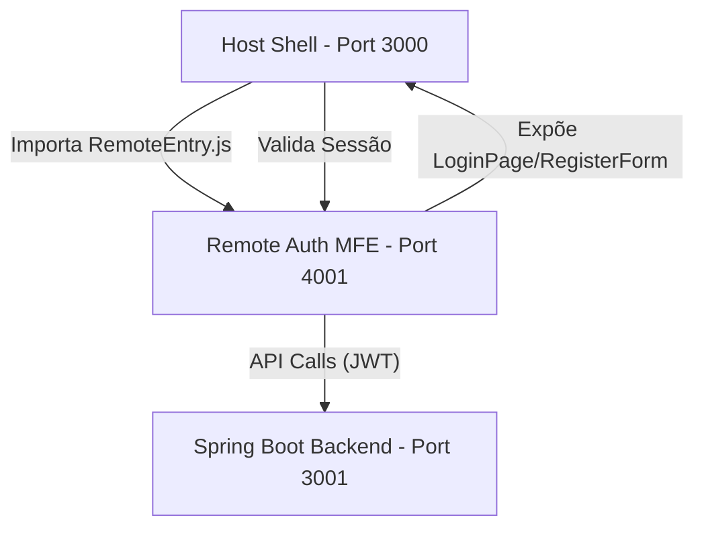

# Arquitetura de Microfrontends (MFE)

Este documento detalha a implementação da arquitetura baseada em Microfrontends utilizando Module Federation para o projeto Grupo-3.

## Visão Geral
A arquitetura é composta por um **Shell (Host)** e múltiplos **Remotes**. No momento, o sistema foca no remote de autenticação e gerenciamento de usuários.

## Tecnologias
- **React 18** com **TypeScript**.
- **Vite** como build tool e dev server.
- **@originjs/vite-plugin-federation** para implementação do Module Federation.

## Diagrama de Comunicação

## Configuração do Federation
### Host (Shell)
O Shell é o ponto de entrada único. Ele consome o remote de autenticação dinamicamente.
- **Remotes**: `mfe_auth` mapeado para a URL definida em `VITE_MFE_AUTH_URL`.
- **Shared Dependencies**:
  - `react` / `react-dom`
  - `@mui/material`
  - `@emotion/react`
  - `@emotion/styled`

### Remote (Auth MFE)
O remote expõe componentes específicos e contratos de serviço.
- **Exposes**:
  - `./LoginPage`: Página completa de login.
  - `./RegisterForm`: Formulário de cadastro reutilizável.
  - `./AuthContract`: Tipos e interfaces de contrato.

## Tratamento de Erros e Resiliência
- **Suspense & Lazy Loading**: Todos os componentes remotos são carregados via `React.lazy` para otimizar o bundle inicial.
- **Error Boundaries**: O Shell envolve os remotes em Error Boundaries para garantir que falhas em um microfrontend não derrubem a aplicação inteira.
- **Fallbacks**: Interfaces de carregamento (Skeleton/Spinners) em português para melhor UX.

## Segurança
- **JWT (JSON Web Token)**: Centralizado no Remote Auth, mas compartilhado com o Shell via contexto.
- **HttpOnly vs LocalStorage**: O sistema está preparado para transição de segurança conforme o hardening avança.
- **Interceptors**: Cliente HTTP injeta automaticamente o Header `Authorization: Bearer <token>` em todas as requisições para o backend.
