# Fase 5 - TDD de Testes Unitários do Frontend

## Objetivo

Configurar uma base de testes unitários para o remote MFE usando Vitest e React Testing Library.

## Vermelho

Os testes devem cobrir inicialmente:

- Renderização do formulário de login.
- Submissão do login chamando `AuthContext`.
- Renderização do formulário de cadastro.
- Submissão de cadastro chamando `AuthContext`.
- Cliente HTTP anexando Bearer JWT.
- Cliente HTTP limpando token em `401`.

## Verde

Comportamentos esperados:

- `npm test` executa a suíte.
- `npm run test:coverage` gera cobertura.
- Componentes principais do remote auth possuem testes iniciais.

## Observação

O shell ainda está em JavaScript. A suíte inicial foi adicionada no remote TypeScript (`front-end`). A expansão para o shell fica para a próxima passada ou para a migração do shell para TypeScript.

## Melhorias Aplicadas

- Scripts `test`, `test:watch` e `test:coverage` adicionados ao remote.
- Vitest configurado com ambiente `jsdom`.
- React Testing Library configurado com `@testing-library/jest-dom`.
- Testes iniciais adicionados para `LoginForm`, `RegisterForm` e `httpClient`.

## Validação

Validar no terminal com Node/NPM:

```powershell
cd .\Grupo-3\front-end
npm install
npm test
npm run build
```

Validação realizada via WSL Ubuntu:

```bash
cd /mnt/c/Users/rafae/Downloads/Grupo-3/Grupo-3/front-end
npm install
npm test
npm run build
```

Resultado dos testes:

```text
Test Files  3 passed (3)
Tests       6 passed (6)
```

Resultado do build:

```text
vite v5.4.21 building for production...
936 modules transformed.
remoteEntry.js gerado.
built in 17.61s
```

Status: testes e build do remote MFE aprovados.
# Fase 6 - TDD de Infraestrutura e MiniStack

## Objetivo

Validar a stack local e reduzir falhas de configuração antes dos testes integrados completos.

## Vermelho

As validações devem cobrir:

- `.env` pode ser criado/atualizado por comando.
- `docker compose config` renderiza com `.env`.
- Variáveis obrigatórias são verificadas.
- URLs locais principais respondem quando a stack está rodando.
- Logs e status dos containers podem ser consultados por script.

## Verde

Comportamentos esperados:

- Script de ambiente prepara `JWT_SECRET`, credenciais locais e URLs.
- Smoke test valida shell, remote entry, backend e MiniStack.
- Erros de infraestrutura aparecem com mensagens claras.

## Melhorias Aplicadas

- Criado script `setup-env.ps1` para preparar `.env`.
- Criado script `smoke-infra.ps1` para validar Compose e endpoints locais.
- Compose foi ajustado para usar `VITE_MS_AUTH_URL` com `/api/auth`.

## Validação

Validação de configuração executada:

```powershell
powershell -ExecutionPolicy Bypass -File .\Grupo-3\scripts\smoke-infra.ps1 -SkipHttp
docker compose --env-file .env.example config --quiet
```

Resultado:

```text
OK: docker compose config valido
```

O smoke HTTP completo deve ser executado com Docker Desktop e a stack rodando:

```powershell
powershell -ExecutionPolicy Bypass -File .\Grupo-3\scripts\smoke-infra.ps1
```
# Fase 7 - Documentação Técnica e Arquitetura

## Arquitetura Geral do Sistema
A aplicação adota uma arquitetura distribuída composta por:
- **Backend:** Spring Boot, responsável por gerenciar regras de negócios, persistência no PostgreSQL e autenticação baseada em JWT.
- **Frontend Micro-Frontends (MFE):** Arquitetura baseada em React e Vite com o plugin Module Federation.
  - **Host (Shell):** Ponto de entrada da aplicação (`chave-shell`).
  - **Remote:** Módulo de autenticação (`chave-mfe-auth`).
- **Infraestrutura Local:** Docker Compose orquestrando o banco de dados PostgreSQL, LocalStack/MiniStack para simulação AWS (API Gateway) e um container com Terraform para provisionamento local.

## Diagrama de Integração (Mermaid)

```mermaid
graph TD;
    Shell[Frontend Shell - Porta 3000] -->|Consome remoteEntry| MFEAuth[MFE Autenticação - Porta 4001];
    Shell -->|Requisições API via Gateway| MiniStack[MiniStack API Gateway - Porta 4566];
    MFEAuth -->|Requisições API via Gateway| MiniStack;
    MiniStack -->|Roteia requisições| Backend[Backend Spring Boot - Porta 3001/8080];
    Backend -->|Persistência| DB[(PostgreSQL - Porta 5432)];
    Terraform[Terraform Provisioner] -->|Configura Gateway| MiniStack;
```



## Contêineres e Portas
- `postgres` (Porta 5432): Banco de dados relacional.
- `ministack` (Porta 4566): Emulador de serviços cloud.
- `infra-provisioner`: Executa scripts Terraform para inicializar os serviços mockados no MiniStack.
- `chave-ms-auth` (Porta 3001): Aplicação backend principal.
- `chave-mfe-auth` (Porta 4001): Micro-frontend isolado para regras de login.
- `chave-shell` (Porta 3000): Aplicação container que integra as páginas e remotes.
# Fase 8 - Guia de UI / Design System

## Introdução
Este guia define os padrões visuais baseados na biblioteca **Material-UI (MUI)** adotada no projeto, buscando consistência nas aplicações front-end (Host e Remotes). O objetivo é uma estética corporativa (Enterprise UI), moderna e adaptável.

## Paleta de Cores e Temas
A aplicação deve suportar **Light Mode** e **Dark Mode**.
- **Primária (Primary):** Azul corporativo escuro (`#1976d2`).
- **Secundária (Secondary):** Tonalidades de destaque (`#dc004e`).
- **Background (Light):** Tons pastéis ou branco absoluto (`#ffffff` / `#f4f6f8`).
- **Background (Dark):** Cinza escuro ou preto suavizado (`#121212`).

## Tipografia
- Fonte base recomendada: **Inter** ou **Roboto**.
- Cabeçalhos (H1 a H6) com pesos variando de `400` a `700`.
- Texto padrão do corpo com tamanho legível (e.g., `1rem` base).

## Espaçamentos e Layouts
- **Grid de 8px:** Todo o layout segue a escala de 8px (margins, paddings). Ex: `theme.spacing(1) = 8px`, `theme.spacing(2) = 16px`.
- **Componentes Centrais:**
  - `Navbar`: Fixada no topo com elevação sutil (box-shadow).
  - `Sidebar`: Responsiva (drawer fixo no desktop, overlay no mobile).
  - `Dashboard/Containers`: Utilizam `<Container maxWidth="lg">` para limitação de largura e legibilidade.

## Componentes Reutilizáveis a Documentar
- **Botões:** Padrões `contained`, `outlined` e `text` previstos no MUI.
- **Campos de Formulário (TextField):** Variante `outlined` ativada por padrão com suporte a validação e mensagens de erro integradas (vermelho para erros).
- **Cards:** Com bordas arredondadas (radius leve, ex: `8px`) e sombras sutis para sensação de profundidade e glassmorphism se aplicável.

## Responsividade
- Utilizar breakpoints do MUI (`xs`, `sm`, `md`, `lg`, `xl`).
- Ocultar Sidebars em tamanhos menores (`xs` e `sm`) em favor de um menu *Hamburger*.
