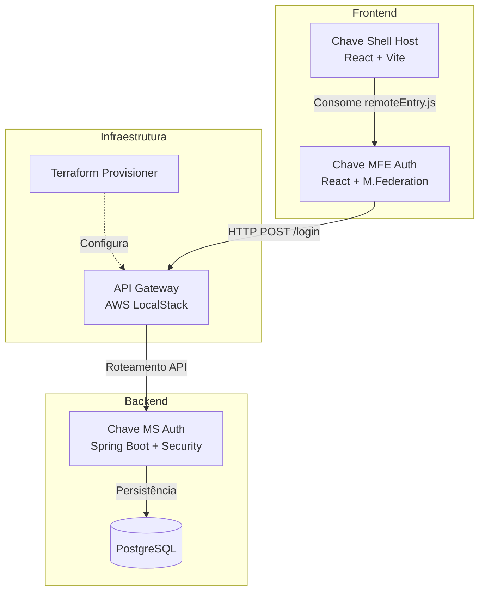

[README.md](https://github.com/user-attachments/files/27650572/README.md)
# Chave - Enterprise Micro-Frontend Architecture


Bem-vindo ao repositório do **Chave**, uma arquitetura corporativa completa baseada em Micro-frontends (MFE), com backend robusto em Java e provisionamento de infraestrutura automatizado.

Este projeto foi construído seguindo rigorosos padrões de **TDD (Test-Driven Development)**, garantindo confiabilidade, tipagem forte com TypeScript e segurança através da federação de módulos.

---

## 📑 Índice
- [Chave - Enterprise Micro-Frontend Architecture](#chave---enterprise-micro-frontend-architecture)
  - [📑 Índice](#-índice)
  - [🏛️ Arquitetura do Sistema](#️-arquitetura-do-sistema)
  - [🏗️ Estrutura do Monorepo](#️-estrutura-do-monorepo)
  - [🚀 Como Executar Localmente](#-como-executar-localmente)
    - [1. Infraestrutura e Backend (Docker)](#1-infraestrutura-e-backend-docker)
    - [2. Micro-frontends (MFE & Shell)](#2-micro-frontends-mfe--shell)
  - [🧪 Qualidade e Testes Automatizados](#-qualidade-e-testes-automatizados)
  - [📚 Documentação Técnica](#-documentação-técnica)
  - [⚠️ Troubleshooting: Tela Branca ou Versão Antiga](#-troubleshooting-tela-branca-ou-versão-antiga)

---

## 🏛️ Arquitetura do Sistema

A comunicação da aplicação é descentralizada. O **Shell** atua como host principal (Container), consumindo a federação do **MFE Auth** (Remote) em tempo de execução via *Module Federation*. Toda chamada externa do MFE é roteada para o Backend protegido.



---

## 🏗️ Estrutura do Monorepo

O projeto é dividido em domínios arquiteturais claros:

- 🟢 **`Trabalho_Eng_Soft_II` (Backend):** Aplicação Spring Boot e JPA. Filtros de segurança via JWT e testes cobertos por JaCoCo (>70%).
- 🔵 **`front-end` (MFE Remoto):** Aplicação encapsulada expondo o domínio de Autenticação (`LoginPage`, `RegisterForm` e Lógica de Sessão).
- 🔵 **`chave-shell-main` (Shell Host):** Ponto de entrada do usuário (`localhost:3000`). Gerencia as rotas protegidas (`PrivateRoute`) e layout global (Material UI).
- 🟣 **`chave-infra-main` (Infraestrutura):** Orquestração completa (`docker-compose.yml`) integrando o AWS MiniStack, Postgres e rodando os scripts do Terraform automaticamente.

---

## 🚀 Como Executar Localmente

> **Pré-requisitos:** Docker Desktop instalado e rodando.

### Iniciar todo o Ecossistema (Infra, DB, Backend e MFEs)

O projeto está configurado para subir todas as aplicações de forma orquestrada via Docker Compose.

Abra o terminal na raiz do projeto e navegue até a pasta de infraestrutura:
```bash
cd chave-infra-main/chave-infra-main
cp .env.example .env
```

**Se você estiver no Linux, Mac ou WSL (com `make` instalado):**
```bash
make setup
```

**Se você estiver no Prompt de Comando / PowerShell (Windows):**
```bash
docker compose up -d postgres ministack
docker compose run --rm infra-provisioner init
docker compose run --rm infra-provisioner apply -auto-approve
docker compose up -d
```

Após a execução, **todos os serviços** estarão disponíveis automaticamente:
* 🌐 **Aplicação Completa (Shell):** [http://localhost:3000](http://localhost:3000)
* 📜 **Swagger (API Docs):** [http://localhost:3001/swagger-ui/index.html](http://localhost:3001/swagger-ui/index.html)
* 🧩 **MFE Auth (Isolado):** [http://localhost:4001](http://localhost:4001)

> **Nota para Desenvolvimento Local:** Se desejar rodar os Front-ends (`front-end` e `chave-shell-main`) usando `npm run dev` para ver alterações em tempo real (hot-reload), certifique-se de parar os contêineres deles no Docker primeiro (`docker stop chave-shell chave-mfe-auth`) para liberar as portas.

---

## 🧪 Qualidade e Testes Automatizados

O sistema foi rigorosamente coberto usando metodologias ágeis.

- **Backend (JUnit/Mockito):** Regras de JaCoCo ativas falham o build se a cobertura ficar abaixo de 70%.
  ```bash
  cd Trabalho_Eng_Soft_II
  # No Windows (PowerShell):
  .\mvnw verify
  # No Linux/WSL (se der erro de 'bad interpreter'):
  sed -i 's/\r$//' ./mvnw
  chmod +x mvnw && ./mvnw verify
  ```
- **Frontends (Vitest + Testing Library):** Mock de APIs e rotas.
  ```bash
  # Para o remote MFE:
  cd front-end
  npm run test:coverage
  # Para o Shell:
  cd chave-shell-main/chave-shell-main
  npm run test:coverage
  ```
- **Smoke Tests E2E:** Um script em PowerShell foi criado para validar se todas as camadas (Gateway, Backend, Remote e Shell) estão de pé.
  ```bash
  cd scripts
  # No Windows (PowerShell):
  powershell -ExecutionPolicy Bypass -File .\smoke_tests.ps1
  # No Linux/WSL:
  powershell.exe -ExecutionPolicy Bypass -File ./smoke_tests.ps1
  ```

---

## 📚 Documentação Técnica

Os detalhes arquiteturais, registros do TDD e guias de resolução de problemas estão centralizados na pasta `/docs`:

* 🏗️ **Arquitetura:** 
  * [Baseline e Requisitos](./Grupo-3/docs/architecture/01-baseline-system.md)
  * [Critérios de Aceite](./Grupo-3/docs/architecture/02-acceptance-criteria.md)
  * [Trade-offs e Decisões](./Grupo-3/docs/architecture/03-trade-offs.md)
* ⚙️ **DevOps e CI/CD:**
  * [Runbook Local](./Grupo-3/docs/devops/runbook-and-troubleshooting.md)
  * [Configuração do Pipeline (GitHub Actions)](../.github/workflows/pipeline.yml)
* 🎨 **Design System:**
  * [Manual de UI](./Grupo-3/docs/ui-manual.md)
* 📊 **Avaliação:**
  * [Critérios Avaliativos](./Grupo-3/docs/assessment-criteria.md)
* 📜 **Jornada TDD (Histórico):**
  * [Logs do Backend](./Grupo-3/docs/tdd-journey/backend-tdd-logs.md)
  * [Logs do Frontend](./Grupo-3/docs/tdd-journey/frontend-tdd-logs.md)
  * [Logs de CI/CD](./Grupo-3/docs/tdd-journey/ci-cd-tdd-logs.md)

---

## ⚠️ Troubleshooting: Tela Branca ou Versão Antiga

Se você ou algum membro da equipe clonou o repositório e está vendo uma tela branca (White Screen) ou uma versão antiga (ex: escrito "MFE Auth Standalone"), siga estes passos para limpar o cache do Docker e forçar a atualização:

1.  **Limpar o ambiente atual:**
    ```bash
    cd chave-infra-main/chave-infra-main
    docker compose down
    ```
2.  **Puxar as atualizações mais recentes:**
    ```bash
    git pull origin main
    ```
3.  **Forçar o Build do zero (CRUCIAL):**
    ```bash
    docker compose up --build
    ```
    *O `--build` garante que o Docker não use imagens antigas em cache.*

4.  **Limpar Cache do Navegador:**
    Abra o sistema em uma **Janela Anônima** (`Ctrl+Shift+N`) para garantir que o navegador não esteja servindo arquivos JavaScript antigos salvos localmente.

---
*Desenvolvido pela Equipe do Grupo 3 - Disciplina de Engenharia de Software II.*
